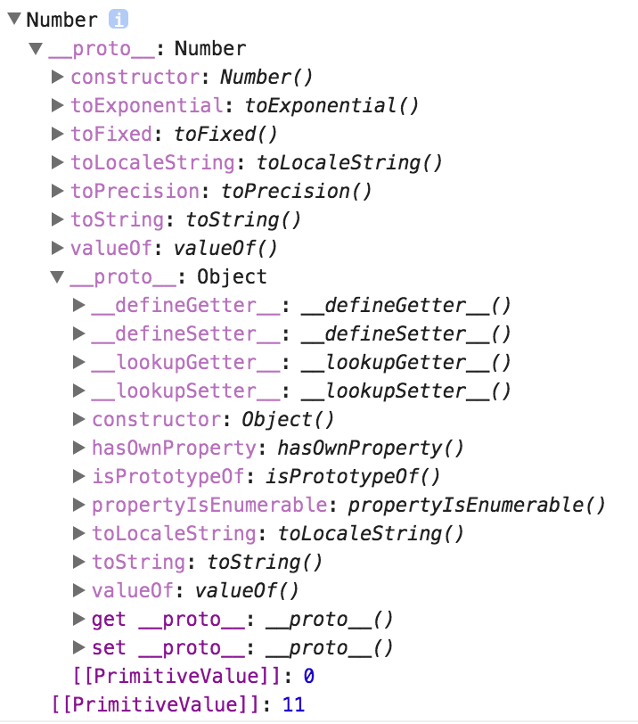

# Number
* Number type(Primitive values)
* Number object(Wrapper object)

## Number type(Primitive values)
ES에서 숫자형은 단 하나의 자료형 뿐입니다.  
[double-precision 64-bit binary format IEEE 754 value](https://en.wikipedia.org/wiki/Double-precision_floating-point_format)  
  
1. 부호(Sign)를 표현하기 위한 1비트 (+, -)  
2. 지수부(exponent part)를 표현하기 위한 11비트  
3. 가수부(significand part)를 표현하기 위한 52비트

범위: -(2<sup>53</sup>-1) ~ 2<sup>53</sup>-1
```javascript
console.log(Number.MIN_SAFE_INTEGER); // -9007199254740991
console.log(-(Math.pow(2, 53) - 1)); // -9007199254740991
console.log(Number.MAX_SAFE_INTEGER); // 9007199254740991
console.log(Math.pow(2, 53) - 1); // 9007199254740991
```

즉 ES에서 정수형(Integer)은 존재하지 않습니다.  
모든 숫자는 부동 소수점(Floating Point) 형태로 표현되는 실수(Real Number)입니다.
```javascript
console.log(1 === 1.0); // true
```

또한 숫자형에서는 특수한 세 가지 값이 존재합니다.
1. (+)Infinity  
2. -Infinity  
3. NaN(Not a Number)

또한 0은 (+)0과 -0으로 나뉘어있습니다.  
하지만 그 둘의 값은 같습니다.
```javascript
console.log(0 === -0); // true
console.log(1 / 0); // Infinity
console.log(1 / -0); // -Infinity
console.log(Infinity === -Infinity); // false
console.log(1 / 'A'); // NaN
```

## Number object(Wrapper object)
* As functions
* As constructors

### As functions
#### Syntax
```javascript
Number(value);
```
#### Parameter
value: 어떠한 데이터 타입의 값도 올 수 있음.

#### Usage
매개변수로 넘긴 값들을 숫자로 바꿀 때 사용.

#### Example
```javascript
console.log(Number('11')); // 11
console.log(Number('11.11')); // 11.11
console.log(Number('11A')); // NaN
console.log(Number('A11')); // NaN
console.log(Number('11A1')); // NaN
console.log(Number('11.A')); // NaN
console.log(Number('011')); // 11
console.log(Number(true)); // 1
console.log(Number(new Date())); // 1481186433309
console.log(Number([0, 1])); // NaN
console.log(Number({a: 'b'})); // NaN
console.log(Number(11)); // 11
```

### As constructors
#### Syntax
```javascript
new Number(value);
```

#### Parameter
value: 숫자값 형태로 이루어진 객체.

#### Structure
```javascript
const objNum = new Number(11);
console.log(typeof objNum); // 'object'
console.dir(objNum);
```


#### Necessity
[The Secret Life of JavaScript Primitives](https://javascriptweblog.wordpress.com/2010/09/27/the-secret-life-of-javascript-primitives/)  
ES에서 숫자형의 프로퍼티와 메소드를 사용할 때 내부 동작 원리는 아래와 같음.
```javascript
// 우리가 알던 방식대로 메소드 사용.
11.1.toString(); // '11.1';

/*
 * Number.prototype.toString() 메소드를 쓰기 위해서
 * 원시값인 11.1을 Number 객체로 바꿔줘야함.
 * 따라서 위 내용은 아래와 같이 자동으로 동작하게 됨.
 */
new Number(11.1).toString(); // 11.1
```

#### Properties
1. Number.EPSILON  
2. Number.MIN_SAFE_INTEGER  
3. Number.MAX_SAFE_INTEGER  
4. Number.prototype  
  1. Number.prototype.toExponential()
  2. Number.prototype.toPrecision()
  3. Number.prototype.toFixed()

##### Number.EPSILON
```javascript
console.log(.1 + .2); // 0.30000000000000004
console.log(0.1 + 0.2 === 0.3); // false
```
ES에서는 위와 같이 소수점 계산에서 고질적인 문제를 안고 있습니다.  
이는 아마 ES에서 쓰는 숫자형인  
[double-precision 64-bit binary format IEEE 754 value](https://en.wikipedia.org/wiki/Double-precision_floating-point_format)의 문제라고 생각합니다.  
어찌보면 0.00000000000000004 정도의 오차는 무시되도 되는 숫자입니다.  
이렇게 무시되어도 될 정도의 오차를 구분하기 위해 등장한 프로퍼티입니다.
```javascript
console.log(5e2); // 500
console.log(5e-2); // 0.05
console.log(0.5e2); // 50

console.log(Number.EPSILON); // 2.220446049250313e-16
console.log(Number.EPSILON.toFixed(20)); // 0.00000000000000022204
```

과연 0.0000000000000004는 무시돼도 될 정도의 오차인지 살펴봅시다.
```javascript
/*
 * 0.00000000000000004
 * 0.00000000000000022204
 */
console.log(0.0000000000000004 < Number.EPSILON)
```

즉 좌변에 있는 값이 우변에 있는 Number.EPSILON 보다도 작다면 무시해도 되는 오차입니다.  

```javascript
// 이 함수가 true를 반환하면 formula와 result는 동일하다고 보면 됨.
// Number.EPILON은 항상 양수이기 때문에 Math.abs 메소드를 사용하여
// 계산식의 결과를 절대값으로 바꾼 후 오차를 비교해야함.
const isEqual = (formula, result) => 
  Math.abs(formula - result) < Number.EPSILON;
console.log(isEqual(0.1 + 1 - 2.2, -1.1)); // true
console.log(isEqual(0.1 + 1 - 2.2, -1.2)); // false
```

##### Number.MIN_SAFE_INTEGER & Number.MAX_SAFE_INTEGER
###### Problem in ES
```javascript
console.log(Number.MIN_VALUE); // 5e-324
console.log(Number.MIN_VALUE - 1); // -1
console.log(Number.MIN_VALUE + 1); // 1
console.log(Number.MAX_VALUE); // 1.7976931348623157e+308
console.log(Number.MAX_VALUE + 1); // 1.7976931348623157e+308
console.log(Number.MAX_VALUE + 1 === Number.MAX_VALUE - 1); // true
```

###### Solution in ES6
```javascript
console.log(Number.MIN_SAFE_INTEGER); // -9007199254740991
console.log(-(Math.pow(2, 53) - 1)); // -9007199254740991
console.log(Number.MIN_SAFE_INTEGER !== Number.MIN_SAFE_INTEGER + 1); // true
console.log(Number.MIN_SAFE_INTEGER - 1 !== Number.MIN_SAFE_INTEGER - 2); // false
console.log(Number.MAX_SAFE_INTEGER); // 9007199254740991
console.log(Math.pow(2, 53) - 1); // 9007199254740991
console.log(Number.MAX_SAFE_INTEGER !== Number.MAX_SAFE_INTEGER - 1); // true
console.log(Number.MAX_SAFE_INTEGER + 1 === Number.MAX_SAFE_INTEGER + 2); // true
```

##### Number.prototype
###### Number.prototype.toPrecision & Number.prototype.toFixed()
```javascript
const num = 123.45678;
console.log(num.toPrecision()); // '123.45678'
console.log(num.toString()); // '123.45678'
console.log(num.toFixed()); // '123'
console.log(num.toPrecision(4)); // '123.5'
console.log(num.toFixed(4)); // '123.4568'
```


### Number <-> String
```javascript
const num1 = '10';
const num2 = '10';
const sum = num1 + num2; // '1010'
const sub = num1 - num2; // 0
const mul = num1 * num2; // 100
const div = num1 / num2; // 1
```
#### String to Number
* parseInt(string[, radix])
* parseFloat(string)
* Number()
* +object, 1*object

##### parseInt(str[, radix])
```javascript
console.log(parseInt('11')); // 11
console.log(parseInt('11.11')); // 11
console.log(parseInt('11A')); // 11
console.log(parseInt('A11')); // NaN
console.log(parseInt('11A1')); // 11
console.log(parseInt('11.A')); // 11
console.log(parseInt('011')); // 11
console.log(parseInt('11 0')); // 11
console.log(parseInt(true)); // NaN
console.log(parseInt(new Date())); // NaN
```

##### parseFloat(str)
```javascript
console.log(parseFloat('11')); // 11
console.log(parseFloat('11.11')); // 11.11
console.log(parseFloat('11A')); // 11
console.log(parseFloat('A11')); // NaN
console.log(parseFloat('11A1')); // 11
console.log(parseFloat('11.A')); // 11
console.log(parseFloat('011')); // 11
console.log(parseFloat('11 0')); // 11
console.log(parseFloat(true)); // NaN
console.log(parseFloat(new Date())); // NaN
```

##### Number(object)
```javascript
console.log(Number('11')); // 11
console.log(Number('11.11')); // 11.11
console.log(Number('11A')); // NaN
console.log(Number('A11')); // NaN
console.log(Number('11A1')); // NaN
console.log(Number('11.A')); // NaN
console.log(Number('011')); // 11
console.log(Number(true)); // 1
console.log(Number(new Date())); // 1481186433309
```

##### +str, 1*str
```javascript
console.log(+'11'); // 11
console.log(+'11.11'); // 11.11
console.log(+'11A'); // NaN
console.log(+'A11'); // NaN
console.log(+'11A1'); // NaN
console.log(+'11.A'); // NaN
console.log(+'011'); // 11
console.log(+true); // 1
console.log(+new Date()); // 1481186433309
```

##### Performance
```javascript
const iterations = 10000000;
console.time('parseInt()');
for(let i=0; i<iterations; i++){
    parseInt('1.1'); // parseInt(): 561.062ms
}
console.timeEnd('parseInt()');
console.time('parseFloat()');
for(let i=0; i<iterations; i++){
    parseFloat('1.1'); // parseFloat(): 737.437ms
}
console.timeEnd('parseFloat()');
console.time('Number()');
for(let i=0; i<iterations; i++){
    Number('1.1'); // Number(): 844.648ms
}
console.timeEnd('Number()');
console.time('+string');
for(let i=0; i<iterations; i++){
    +'1.1'; // +string: 20.724ms
}
console.timeEnd('+string');
console.time('1*string');
for(let i=0; i<iterations; i++){
    1*'1.1'; // 1*string: 21.459ms
}
console.timeEnd('1*string');
```

#### Number to String
* Number.prototype.toString()
* String(number)
* '' + number

##### Number.prototype.toString()
```javascript
console.log(1.1.toString()); // '1.1'
console.log(1.0.toString()); // '1'
console.log(0b11.toString()); // '3'
console.log(NaN.toString()); // 'NaN'
console.log(Infinity.toString()); // 'Infinity'
console.log(-Infinity.toString()); // -Infinity
console.log(0.0.toString()); // '0'
```

##### String(number)
```javascript
console.log(String(1.1)); // '1.1'
console.log(String(1)); // '1'
console.log(String(0b11)); // '3'
console.log(String(NaN)); // 'NaN'
console.log(String(Infinity)); // 'Infinity'
console.log(String(-Infinity)); // '-Infinity'
console.log(String(0)); // '0'
```

##### '' + number
```javascript
console.log('' + 1.1); // '1.1'
console.log('' + 1); // '1'
console.log('' + 0b11); // '3'
console.log('' + NaN); // 'NaN'
console.log('' + Infinity); // 'Infinity'
console.log('' + -Infinity); // '-Infinity'
console.log('' + 0); // '0'
```

##### Performance
```javascript
const iterations = 10000000;
console.time('Number.prototype.toString()');
for(let i=0; i<iterations; i++){
    1.1.toString(); // Number.prototype.toString(): 268.619ms
}
console.timeEnd('Number.prototype.toString()');
console.time('String(number)');
for(let i=0; i<iterations; i++){
    String(1.1); // String(): 159.045ms
}
console.timeEnd('String(number)');
console.time('\'\' + number');
for(let i=0; i<iterations; i++){
    '' + 1.1; // '' + number: 20.594ms
}
console.timeEnd('\'\' + number');
```